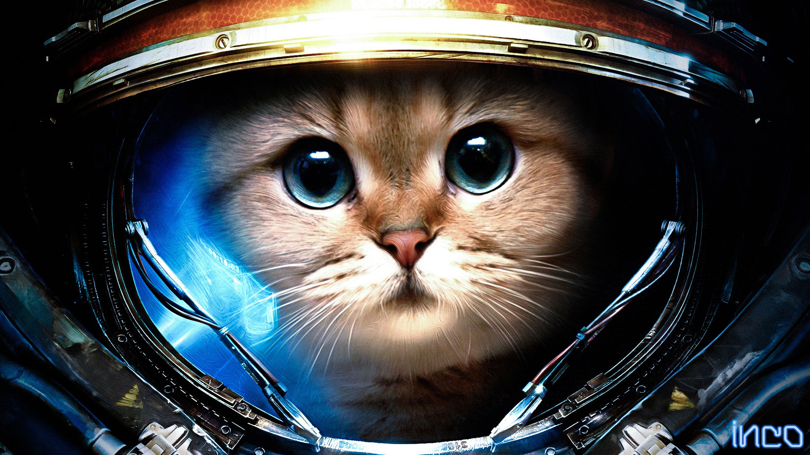

Oooooh-weeee, my first blog post!

Lorem ipsum dolor sit amet, consectetur adipisicing elit. Aliquid animi architecto beatae blanditiis distinctio dolor dolore dolores doloribus eligendi enim eos esse et eum fuga id illo itaque labore magni minima necessitatibus odit porro quo rerum totam ullam ut, voluptatum? Architecto et hic illo, minus perspiciatis quaerat quas sed tempore.

* [ ] https://www.gatsbyjs.org/blog/2017-07-19-creating-a-blog-with-gatsby
* [ ] https://github.com/gatsbyjs/gatsby-starter-blog

``` js
const mesh = new THREE.Mesh(
    new THREE.BoxGeometry(500, 500, 500),
    new THREE.MeshPhongMaterial({
        color: 0x156289,
        emissive: 0x072534,
        side: THREE.DoubleSide,
        shading: THREE.FlatShading
    })
);
scene.add(mesh);
```



<iframe src="https://manu.ninja" width="320" height="240"></iframe>

I now support "typographic" quotes.
